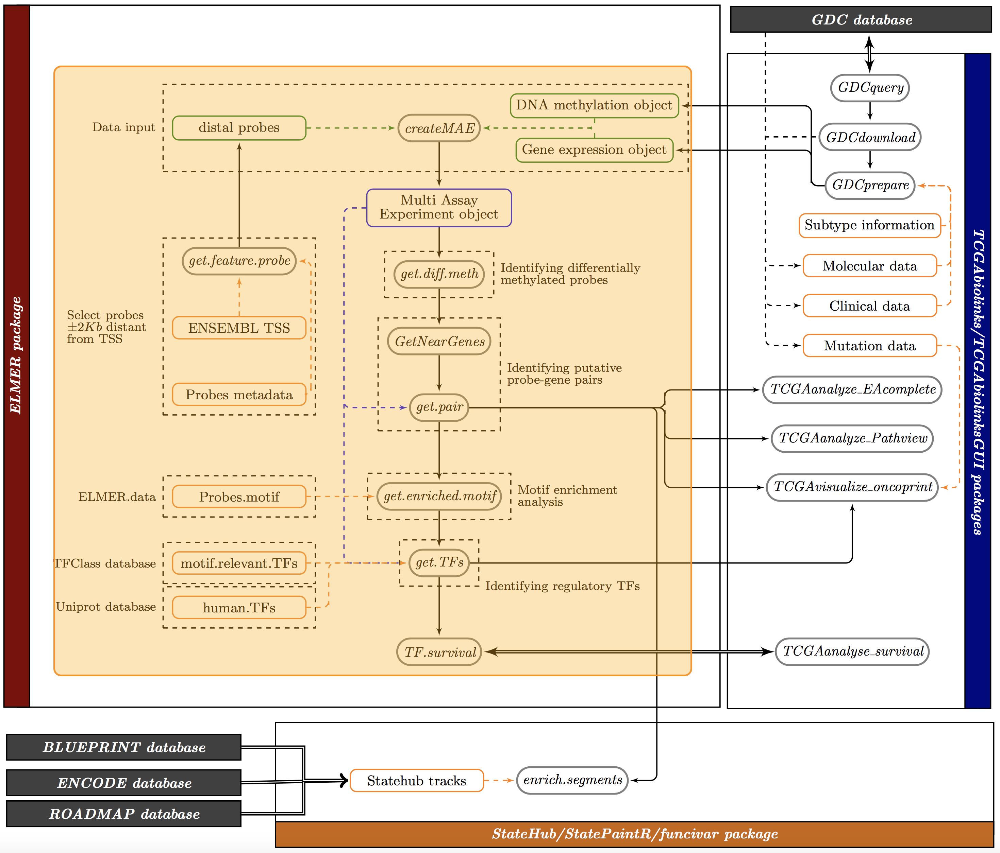
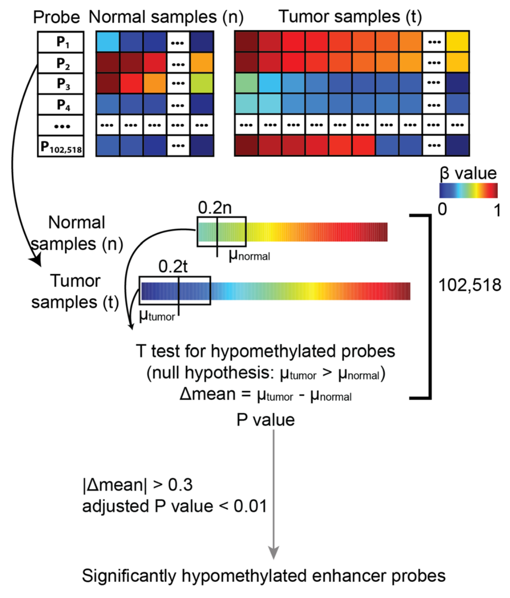
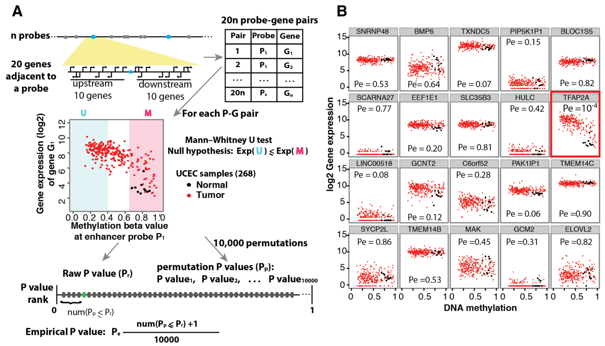
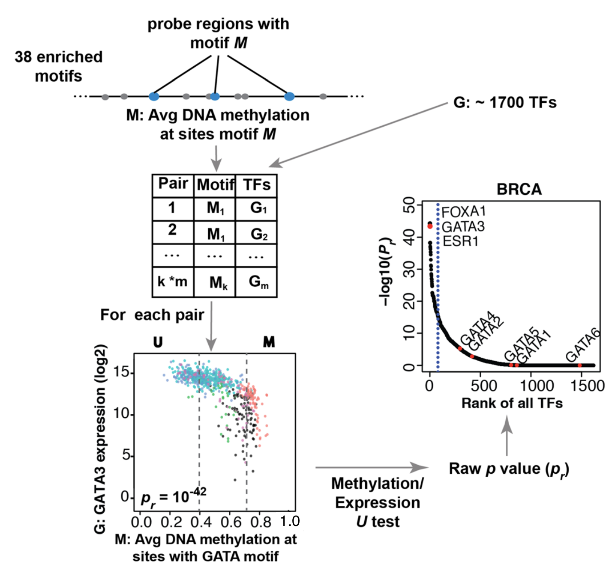

```{r, echo = FALSE,hide=TRUE, message=FALSE,warning = FALSE}
devtools::load_all(".")
```

# Introduction

Another Bioconductor package we will also be introduce is called 
[ELMER](http://bioconductor.org/packages/ELMER/) [@yao2015inferring,@elmer2] which allows 
one to identify DNA methylation changes in distal regulatory regions and correlate 
these signatures with expression of nearby genes to identify transcriptional 
targets associated with cancer. For these distal probes correlated with a gene, 
a transcription factor motif analysis is performed followed by expression 
analysis of transcription factors to infer upstream regulators.

We expect that participants of this workshop will understand the integrative 
analysis performed by using 
[TCGAbiolinks](http://bioconductor.org/packages/TCGAbiolinks/) + 
[ELMER](http://bioconductor.org/packages/ELMER/), as well as be able to execute 
it from the data acquisition process to the final interpretation of the results. 
The workshop assumes users with an intermediate level of familiarity with R, 
and basic understanding of tumor biology. 

The figure below highlights the workflow part which will be covered in this section.


## Loading required libraries

```{r vignette, eval=TRUE, message=FALSE,warning = FALSE}
library(ELMER)
library(DT)
library(dplyr)
```

# ELMER data input


A Multi Assay Experiment object from the `r BiocStyle::Biocpkg("MultiAssayExperiment")` 
package is the input for multiple main functions of `r BiocStyle::Biocpkg("ELMER")`. 
To create it you can use the `createMAE` function.

But instead of using the data previously downloaded, we will use one with more samples provided
in this package.
```{r data, eval=TRUE, message=FALSE, warning = FALSE}
library(MultiAssayExperiment)
lusc.exp
lusc.met
```

Also, we will need to filter the probes in the MAE to select only distal probes.
```{r distal probes, eval=TRUE, message=FALSE, warning = FALSE}
distal.probes <- get.feature.probe(genome = "hg38", met.platform = "450K")
```

The `createMAE` function will receive both DNA methylation and gene expression objects.
Also `filter.probes` argument will select only probes in the regions of the distal.probes
object. 

```{r mae, eval=TRUE, message=FALSE, warning = FALSE}
library(MultiAssayExperiment)
mae <- createMAE(exp = lusc.exp, 
                 met = lusc.met,
                 save = TRUE,
                 linearize.exp = TRUE,
                 filter.probes = distal.probes,
                 save.filename = "mae_bioc2017.rda",
                 met.platform = "450K",
                 genome = "hg19",
                 TCGA = TRUE)
mae
colData(mae)[1:5,] %>%  as.data.frame %>% datatable(options = list(scrollX = TRUE))
sampleMap(mae)[1:5,] %>%  as.data.frame %>% datatable(options = list(scrollX = TRUE))
```


# Analysis

## Identifying differentially methylated probes

This step is to identify DNA methylation changes at distal enhancer probes which is
carried out by function `get.diff.meth`.

For each distal probe, the function first rank samples from group 1 and group 2 samples by their DNA methylation beta values. 
To identify hypomethylated probes, the function compared the lower control quintile (20\% of control samples with the lowest methylation) 
to the lower experiment quintile (20\% of experiment samples with the lowest methylation), using an unpaired one-tailed t-test.




<div class="panel panel-info">
<div class="panel-heading">Main get.diff.meth arguments </div>
<div class="panel-body">
| Argument | Description |
|------------|--------------------------------------------------------------------------------------------------------------------------------------------------------------------------------------------------------------------------------------------------------------------------------------------------------------|
| data | A `multiAssayExperiment` with DNA methylation and Gene Expression data. See `createMAE` function. |
| diff.dir |  A character can be "hypo" or "hyper", showing differential methylation dirction.  It can be "hypo" which is only selecting hypomethylated probes;  "hyper" which is only selecting hypermethylated probes |
| minSubgroupFrac |  A number ranging from 0 to 1,specifying the fraction of extreme samples from group 1 and group 2  that are used to identify the differential DNA methylation.  The default is 0.2 because we typically want to be able to detect a specific (possibly unknown) molecular subtype among tumor; these subtypes often make up only a minority of samples, and 20\% was chosen as a lower bound for the purposes of statistical power. If you are using pre-defined group labels, such as treated replicates vs. untreated replicated, use a value of 1.0 (***Supervised*** mode) |
| pvalue | A number specifies the significant P value (adjusted P value by BH) cutoff for selecting significant hypo/hyper-methylated probes. Default is 0.01 |
| group.col | A column defining the groups of the sample. You can view the available columns using: `colnames(MultiAssayExperiment::colData(data))`. |
| group1 | A group from group.col. ELMER will run group1 vs group2. That means, if direction is hyper, get probes hypermethylated in group 1 compared to group 2. |
| group2 | A group from group.col. ELMER will run group1 vs group2. That means, if direction is hyper, get probes hypermethylated in group 1 compared to group 2. |
| sig.dif | A number specifies the smallest DNA methylation difference as a cutoff for selecting significant hypo/hyper-methylated probes. Default is 0.3. |
</div>
</div>

```{r,eval=TRUE, message=FALSE, warning = FALSE, results = "hide"}
sig.diff <- get.diff.meth(data = mae, 
                          group.col = "definition",
                          group1 =  "Primary solid Tumor",
                          group2 = "Solid Tissue Normal",
                          minSubgroupFrac = 0.2,
                          sig.dif = 0.3,
                          diff.dir = "hypo", # Search for hypomethylated probes in group 1
                          cores = 1, 
                          dir.out ="result", 
                          pvalue = 0.01)
```

```{r,eval=TRUE, message=FALSE, warning = FALSE}
as.data.frame(sig.diff)  %>% datatable(options = list(scrollX = TRUE))
# get.diff.meth automatically save output files. 
# getMethdiff.hypo.probes.csv contains statistics for all the probes.
# getMethdiff.hypo.probes.significant.csv contains only the significant probes which
# is the same with sig.diff
dir(path = "result", pattern = "getMethdiff")  
```

## Identifying putative probe-gene pairs

This step is to link enhancer probes with methylation changes to target genes with expression
changes and report the putative target gene for selected probes. This is carried out
by function `get.pair`. 

For each distal probe with differential methylation the closest 10 upstream 
genes and the closest 10 downstream genes were tested for correlation between 
methylation of the probe and expression of the gene.
Thus, exactly 20 statistical 
tests were performed for each probe, as follows. For each probe-gene pair, 
the samples (all experiment samples and control samples) were divided into two 
groups: the M group, which consisted of the upper methylation quintile (the 20\%
of samples with the highest methylation at the enhancer probe), and the U group, 
which consisted of the lowest methylation quintile (the 20\% of samples with the 
lowest methylation.)
For each probe-gene pair tested, the raw p-value `Pr` was corrected for multiple 
hypothesis using a permutation approach.




<div class="panel panel-info">
<div class="panel-heading">Main get.pair arguments </div>
<div class="panel-body">
| Argument          | Description                                                                                                                                                                                                                                                                                                                                                         |
|-------------------|---------------------------------------------------------------------------------------------------------------------------------------------------------------------------------------------------------------------------------------------------------------------------------------------------------------------------------------------------------------------|
| data              | A multiAssayExperiment with DNA methylation and Gene Expression data. See createMAE function.                                                                                                                                                                                                                                                                       |
| nearGenes         | Can be either a list containing output of GetNearGenes function or path of rda file containing output of `GetNearGenes` function.                                                                                                                                                                                                                                     |
| minSubgroupFrac        | A number ranging from 0 to 1.0 specifying the percentage of samples used to create groups U (unmethylated) and M (methylated) used to link probes to genes. Default is 0.4 (lowest quintile samples will be in the U group and the highest quintile samples in the M group).                                                                                                                                                                                                                                             |
| permu.size        | A number specify the times of permuation. Default is 10000.                                                                                                                                                                                                                                                                                                         |
| pvalue            | A number specify the raw p-value cutoff for defining signficant pairs. Default is 0.05. It will select the significant P value cutoff before calculating the empirical p-values.                                                                                                                                                           |
| Pe                | A number specify the empirical p-value cutoff for defining signficant pairs. Default is 0.001.                                                                                                                                                                                                                        |
| group.col         | A column defining the groups of the sample. You can view the available columns using: `colnames(MultiAssayExperiment::colData(data))`.                                               |
| group1 | A group from group.col. |
| group2 | A group from group.col. |
| filter.probes     | Should filter probes by selecting only probes that have at least a certain number of samples below and above a certain cut-off. See `preAssociationProbeFiltering` function.                                                                                                                                                                                          |
| filter.portion    | A number specify the cut point to define binary methlation level for probe loci. Default is 0.3. When beta value is above 0.3, the probe is methylated and vice versa. For one probe, the percentage of methylated and unmethylated samples should be above filter.percentage value. Only used if filter.probes is TRUE. See preAssociationProbeFiltering function. |
| filter.percentage | Minimum percentage of samples to be considered in methylated and unmethylated for the filter.portion option. Default 5%. Only used if filter.probes is TRUE. See preAssociationProbeFiltering function.   |
</div>
</div>


```{r, eval = TRUE, message = FALSE, warning = FALSE, results = "hide"}
nearGenes <- GetNearGenes(data = mae, 
                         probes = sig.diff$probe, 
                         numFlankingGenes = 20, # 10 upstream and 10 dowstream genes
                         cores = 1)

Hypo.pair <- get.pair(data = mae,
                      group.col = "definition",
                      group1 =  "Primary solid Tumor",
                      group2 = "Solid Tissue Normal",
                      nearGenes = nearGenes,
                      minSubgroupFrac = 0.4, # % of samples to use in to create groups U/M
                      permu.dir = "result/permu",
                      permu.size = 100, # Please set to 100000 to get significant results
                      pvalue = 0.05,   
                      Pe = 0.01, # Please set to 0.001 to get significant results
                      filter.probes = TRUE, # See preAssociationProbeFiltering function
                      filter.percentage = 0.05,
                      filter.portion = 0.3,
                      dir.out = "result",
                      cores = 1,
                      label = "hypo")
```

```{r, eval = TRUE, message = FALSE, warning = FALSE}
Hypo.pair %>% datatable(options = list(scrollX = TRUE))
# get.pair automatically save output files. 
#getPair.hypo.all.pairs.statistic.csv contains statistics for all the probe-gene pairs.
#getPair.hypo.pairs.significant.csv contains only the significant probes which is 
# same with Hypo.pair.
dir(path = "result", pattern = "getPair") 
```


## Motif enrichment analysis on the selected probes

This step is to identify enriched motif in a set of probes which is carried out by
function `get.enriched.motif`.

This function uses a pre-calculated data `Probes.motif` which was generated using HOMER with a $p-value \le 10^{–4}$ 
to scan a $\pm250bp$  region around each probe using HOmo sapiens 
COmprehensive MOdel COllection [http://hocomoco.autosome.ru/](HOCOMOCO) v10 [@kulakovskiy2016hocomoco] position
weight matrices (PWMs). 
For each probe set tested (i.e. the list of gene-linked hypomethylated probes in a given 
group), a motif enrichment Odds Ratio and a 95% confidence interval were 
calculated using following formulas:
$$ p= \frac{a}{a+b} $$
$$ P= \frac{c}{c+d} $$
$$ Odds\quad  Ratio = \frac{\frac{p}{1-p}}{\frac{P}{1-P}} $$
$$ SD = \sqrt{\frac{1}{a}+\frac{1}{b}+\frac{1}{c}+\frac{1}{d}} $$
$$ lower\quad boundary\quad of\quad  95\%\quad  confidence\quad  interval = \exp{(\ln{OR}-SD)} $$

where `a` is the number of probes within the selected probe set that contain one 
or more motif occurrences; `b` is the number of probes within the selected probe 
set that do not contain a motif occurrence; `c` and `d` are the same counts within 
the entire enhancer probe set. A probe set was considered significantly enriched 
for a particular motif if the 95% confidence interval of the Odds Ratio was 
greater than 1.1 (specified by option `lower.OR`, 1.1 is default), and the motif 
occurred at least 10 times (specified by option `min.incidence`. 10 is default) in 
the probe set. As described in the text, Odds Ratios were also used for ranking 
candidate motifs. 


<div class="panel panel-info">
<div class="panel-heading">Main get.pair arguments </div>
<div class="panel-body">
| Argument | Description |
|-------------------|-------------------------------------------------------------------------------------------------------------------------------------------------------------------------------------------------------------------------------------------------------------------------------------------------------------------------------------------------------------------------------------------------------------------------------------------------------------------------------------------------------------------------------------------------------------------------------------|
| data | A multi Assay Experiment from  createMAE function. If set and probes.motif/background probes are missing this will be used to get this other two arguments correctly. This argument is not require, you can set probes.motif and the backaground.probes manually. |
| probes | A vector lists the name of probes to define the set of probes in which motif enrichment OR and confidence interval will be calculated. |
| lower.OR | A number specifies the smallest lower boundary of 95% confidence interval for Odds Ratio. The motif with higher lower boudnary of 95% confidence interval for Odds Ratio than the number are the significantly enriched motifs (detail see reference). |
| min.incidence | A non-negative integer specifies the minimum incidence of motif in the given probes set. 10 is default. |
</div>
</div>

```{r,eval=TRUE, message=FALSE, warning = FALSE}
# Identify enriched motif for significantly hypomethylated probes which 
# have putative target genes.
enriched.motif <- get.enriched.motif(data = mae,
                                     probes = Hypo.pair$Probe, 
                                     dir.out = "result", 
                                     label = "hypo",
                                     min.incidence = 10,
                                     lower.OR = 1.1)
names(enriched.motif) # enriched motifs
head(enriched.motif["P73_HUMAN.H10MO.A"]) ## probes in the given set that have TP53 motif.

# get.enriched.motif automatically save output files. 
# getMotif.hypo.enriched.motifs.rda contains enriched motifs and the probes with the motif. 
# getMotif.hypo.motif.enrichment.csv contains summary of enriched motifs.
dir(path = "result", pattern = "getMotif") 

# motif enrichment figure will be automatically generated.
dir(path = "result", pattern = "motif.enrichment.pdf") 
```


## Identifying regulatory TFs


This step is to identify regulatory TF whose expression associates with TF binding motif 
DNA methylation which is carried out by function `get.TFs`.

For each motif considered to be enriched within a particular probe set, it will
compare the average DNA methylation at all distal enhancer probes within $\pm250bp$  
of a motif occurrence, to the expression of human TFs. A statistical test 
was performed for each motif-TF pair, as follows. The samples (all groups samples) 
were divided into two groups: the M group, which consisted 
of the 20\% of samples with the highest average methylation at all motif-adjacent 
probes, and the U group, which consisted of the 20\% of samples with the lowest 
methylation. For each candidate motif-TF pair, the Mann-Whitney U test was used to test 
the null hypothesis that overall gene expression in group M was greater or equal 
than that in group U.
All TFs were ranked by the $-log_{10}(P_{r})$, and those falling within the top 5% of 
this ranking were considered candidate upstream regulators. 



<div class="panel panel-info">
<div class="panel-heading">Main get.pair arguments </div>
<div class="panel-body">
| Argument | Description |
|--------------------|----------------------------------------------------------------------------------------------------------------------------------------------------------------------------------------------------------------------------------------------------------------------------------|
| data | A multiAssayExperiment with DNA methylation and Gene Expression data. See `createMAE` function. |
| enriched.motif | A list containing output of get.enriched.motif function or a path of XX.rda file containing output of get.enriched.motif function. |
| group.col         | A column defining the groups of the sample. You can view the available columns using: `colnames(MultiAssayExperiment::colData(data))`.                
| group1 | A group from group.col. |
| group2 | A group from group.col. |
| minSubgroupFrac |  A number ranging from 0 to 1 specifying the percentage of samples used to create the groups U (unmethylated)  and M (methylated) used to link probes to TF expression.  Default is 0.4 (lowest quintile of all samples will be in the  U group and the highest quintile of all samples in the M group). |
</div>
</div>


```{r,eval=TRUE, message=FALSE, warning = FALSE, results = "hide"}
## identify regulatory TF for the enriched motifs
TF <- get.TFs(data = mae, 
              group.col = "definition",
              group1 =  "Primary solid Tumor",
              group2 = "Solid Tissue Normal",
              minSubgroupFrac = 0.4,
              enriched.motif = enriched.motif,
              dir.out = "result", 
              cores = 1, 
              label = "hypo")
```

```{r,eval=TRUE, message=FALSE, warning = FALSE}
# get.TFs automatically save output files. 
# getTF.hypo.TFs.with.motif.pvalue.rda contains statistics for all TF with average 
# DNA methylation at sites with the enriched motif.
# getTF.hypo.significant.TFs.with.motif.summary.csv contains only the significant probes.
dir(path = "result", pattern = "getTF")  

# TF ranking plot based on statistics will be automatically generated.
dir(path = "result/TFrankPlot_family/", pattern = "pdf") 
```
# Session Info

```{r sessioninfo, eval=TRUE}
sessionInfo()
devtools::session_info()
```

# Bibliography
