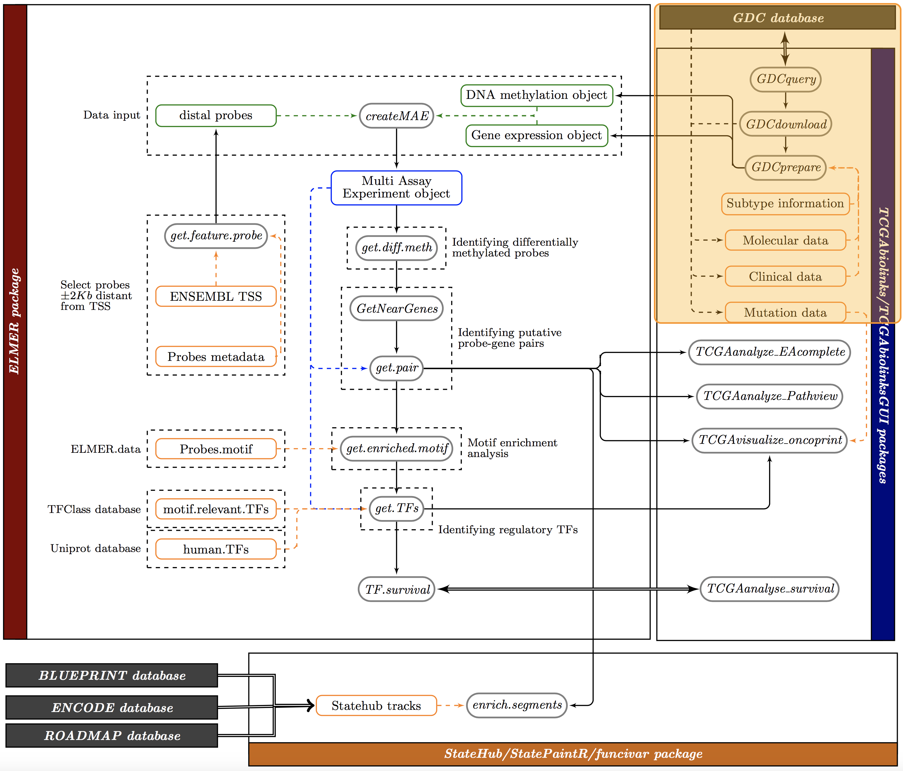
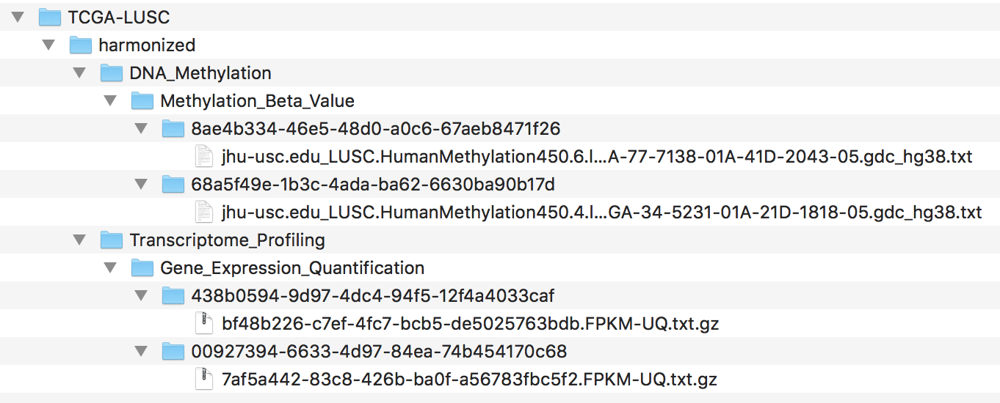

```{r, echo = FALSE,hide=TRUE, message=FALSE,warning=FALSE}
devtools::load_all(".")
```

# Introduction

In this section we will learn to search and download DNA methylation (epigenetic) and 
gene expression (transcription) data from the newly created 
[NCI Genomic Data Commons (GDC) portal](https://portal.gdc.cancer.gov/) 
and prepare them into a Summarized Experiment object. 

The figure below hihglights the workflow part which will be covered in this section.



## Loading required libraries

```{r vignette, eval=TRUE, message=FALSE,warning=F}
library(TCGAbiolinks)
library(SummarizedExperiment)
library(DT)
library(dplyr)
```

# Downloading data

## Gene expression

```{r tcgabiolinks-exp, eval=FALSE}
query.exp <- GDCquery(project = "TCGA-LUSC",
                  data.category = "Transcriptome Profiling",
                  data.type = "Gene Expression Quantification", 
                  workflow.type = "HTSeq - FPKM-UQ",
                   barcode = c("TCGA-34-5231-01","TCGA-77-7138-01"))
GDCdownload(query.exp)
exp <- GDCprepare(query = query.exp,
                          save = TRUE, 
                          save.filename = "Exp_LUSC.rda",
                          summarizedExperiment = TRUE)
```

```{r tcgabiolinks-exp-obj, eval=TRUE}
exp

colData(exp) %>% as.data.frame %>% datatable(options = list(scrollX = TRUE), rownames = TRUE)
assay(exp)[1:5,] %>% datatable (options = list(scrollX = TRUE), rownames = TRUE)
rowRanges(exp)
```

## DNA methylation


This subsection describes how to download DNA methylation using the Bioconductor 
package [TCGAbiolinks](http://bioconductor.org/packages/TCGAbiolinks/) [@TCGAbiolinks]
from [NCI Genomic Data Commons (GDC) portal](https://portal.gdc.cancer.gov/).
In this example we will download DNA methylation data (Infinium HumanMethylation450 platform)
for two TCGA-LUSC (TCGA Lung Squamous Cell Carcinoma) samples.
GDCquery function will search in the GDC database for the information required to 
download the data, this information is used by the `GDCdownload` function 
which will request the files to GDC, those files will be compacted into a 76 MB tar.gz file.
After the download is completed  `GDCdownload` will uncompress the tar.gz file and move 
its files to a folder; the default is GDCData/(Project)/(source)/(data.category)/(data.type)), 
in our example it will be `GDCdata/TCGA-LUSC/harmonized/DNA_Methylation/Methylation_Beta_Value/`




Finally, `GDCprepare` transforms the downloaded data into a
[summarizedExperiment](http://bioconductor.org/packages/SummarizedExperiment/)
object [@huber2015orchestrating] or a data frame. If
*SummarizedExperiment* is set to TRUE, TCGAbiolinks will add to the
object molecular sub-type information, which was defined by The Cancer Genome
Atlas (TCGA) Research Network reports (the full list of papers can be
seen in [TCGAquery\_subtype section](http://bioconductor.org/packages/devel/bioc/vignettes/TCGAbiolinks/inst/doc/tcgaBiolinks.html#tcgaquery_subtype-working-with-molecular-subtypes-data.) in TCGAbiolinks vignette), and clinical information. 

```{r tcgabiolinks-met, eval=FALSE}
query.met <- GDCquery(project = "TCGA-LUSC", 
                      data.category = "DNA Methylation",
                      platform = "Illumina Human Methylation 450", 
                      barcode = c("TCGA-34-5231-01A-21D-1818-05","TCGA-77-7138-01A-41D-2043-05"))
GDCdownload(query.met)
met <- GDCprepare(query = query.met,
                  save = TRUE, 
                  save.filename = "DNAmethylation_LUSC.rda",
                  summarizedExperiment = TRUE)
```

The object created is a Sum
```{r tcgabiolinks-met-obj, eval=TRUE}
library(SummarizedExperiment)
library(DT)
library(dplyr)
met

colData(met) %>% as.data.frame %>% datatable(options = list(scrollX = TRUE), rownames = TRUE)
assay(met)[1:5,] %>% datatable (options = list(scrollX = TRUE), rownames = TRUE)
rowRanges(met)
```

# Bibliography
