```{r, echo = FALSE,hide=TRUE, message=FALSE,warning=FALSE}
devtools::load_all(".")
```

# Introduction

In this section we will learn to search and download DNA methylation (epigenetic) and 
gene expression (transcription) data from the newly created 
[NCI Genomic Data Commons (GDC) portal](https://portal.gdc.cancer.gov/) 
and prepare them into a Summarized Experiment object. 

The figure below hihglights the workflow part which will be covered in this section.


# Downloading data 

## Loading GUI

First we will launch the GUI for TCGAbiolinks.
```{r gui, eval=FALSE, message=FALSE,warning=F}
library(TCGAbiolinksGUI)
TCGAbiolinksGUI()
```

## Gene expression

After launching the GUI select the `GDC Data/Get GDC data/Molecular data`.
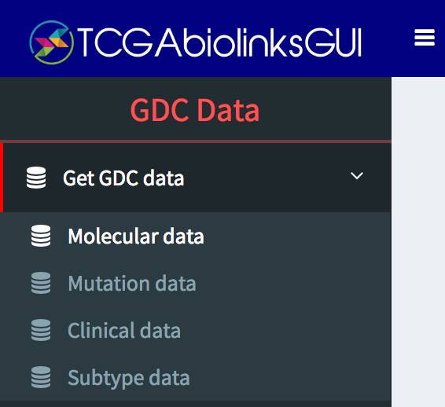

Fill the search fields with the same information below and click on `Visualize Data`.
If you select `Filter  using clinical data` under the clinical filter we will also plot
the clinical information.
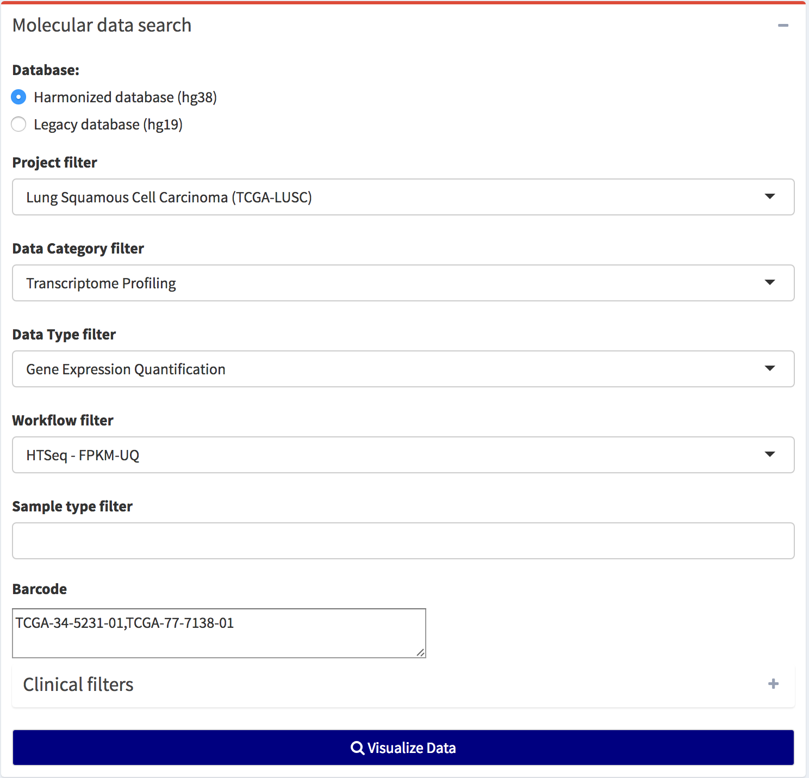

A plot with the summary of the data will be shown. 
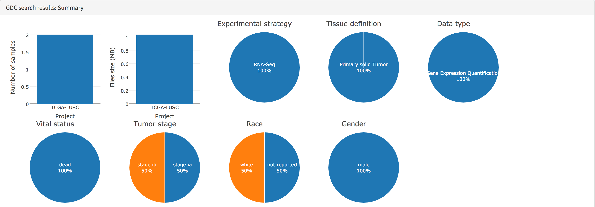
Also, if you want more details you 
can also open the `GDC search results: Results` section.

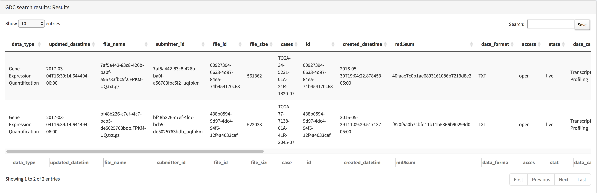

After the query is completed, you will be able to download the data and convert it to
an R object in the `Download & Prepare` section.
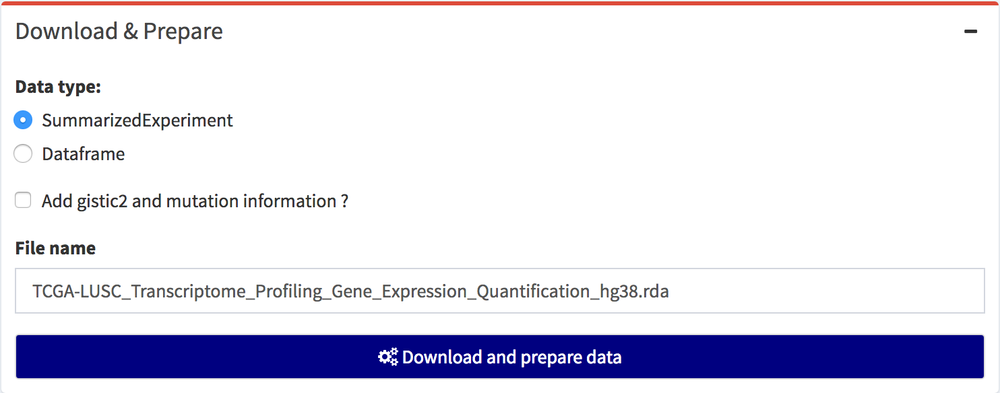
If successful it will give you a message where the data was saved.
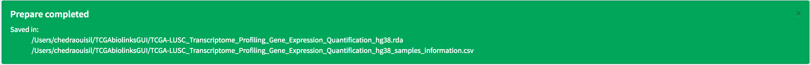
## Visualizing the Summarized Experiment

The integrative data container [SummarizedExperiment object](http://www.nature.com/nmeth/journal/v12/n2/fig_tab/nmeth.3252_F2.html) [@SummarizedExperiment,@huber2015orchestrating]
contains 3 matrices, one with sample metadata, one with features metadata
and one with the assay data.

To visualize the SummarizedExperiment object select  `GDC Data/Manage SummarizedExperiment`:
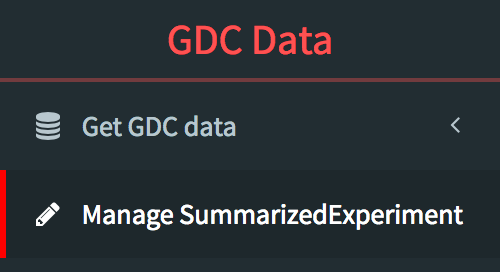

And click on `Select Summarized Experiment file`.
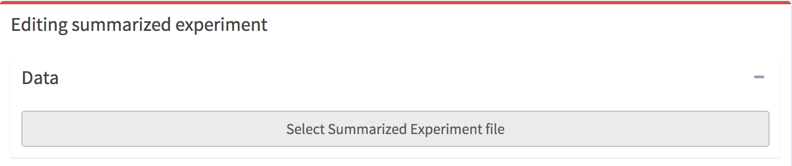
Select the file downloaded from GDC.
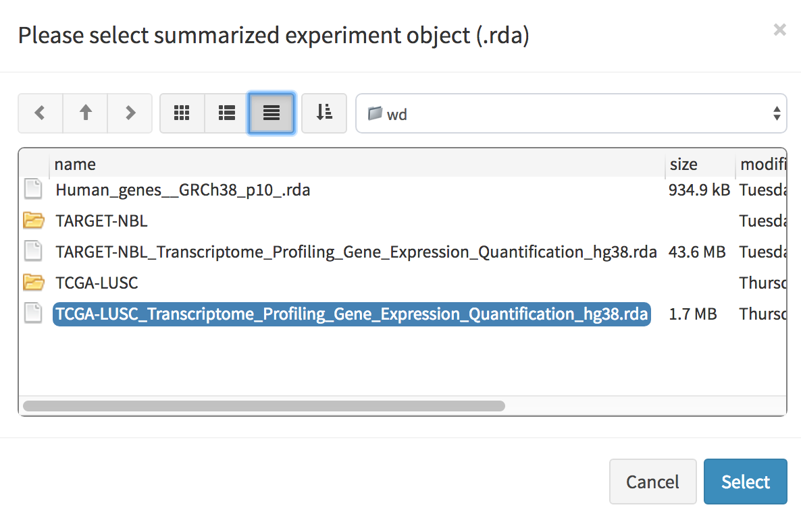
You can access sample metadata
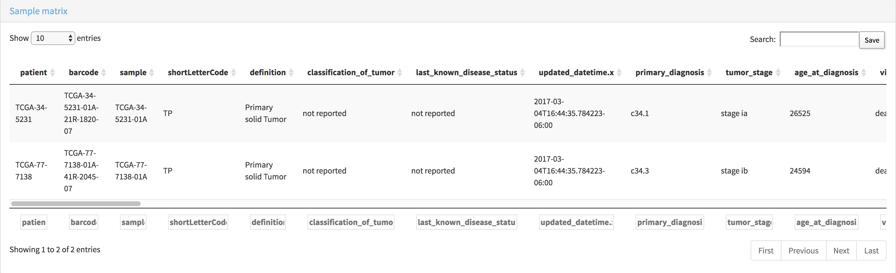
the assay data 
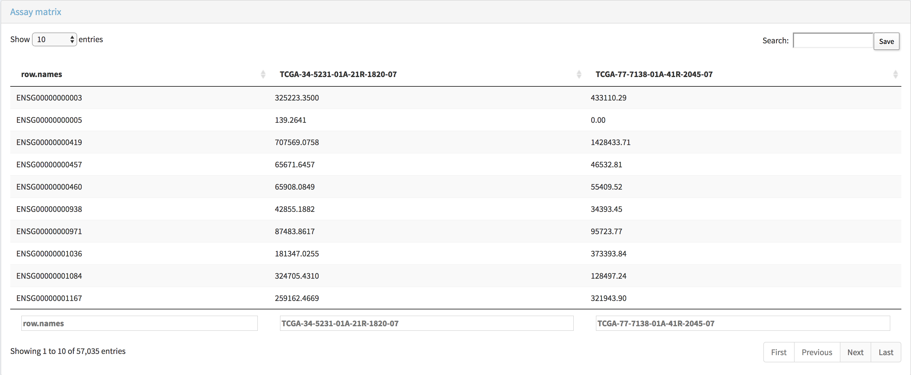

or the features metadata
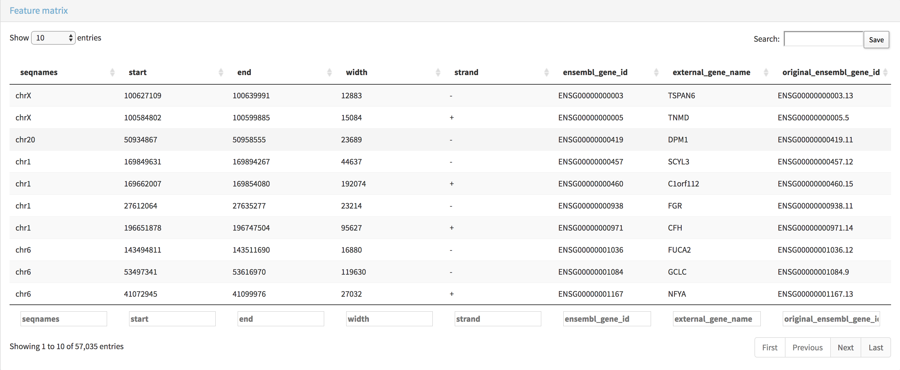


## DNA methylation

Again, fill the search fields with the same information below and click on `Visualize Data`.
If you select `Filter using clinical data` under the clinical filter we will also plot
the clinical information.

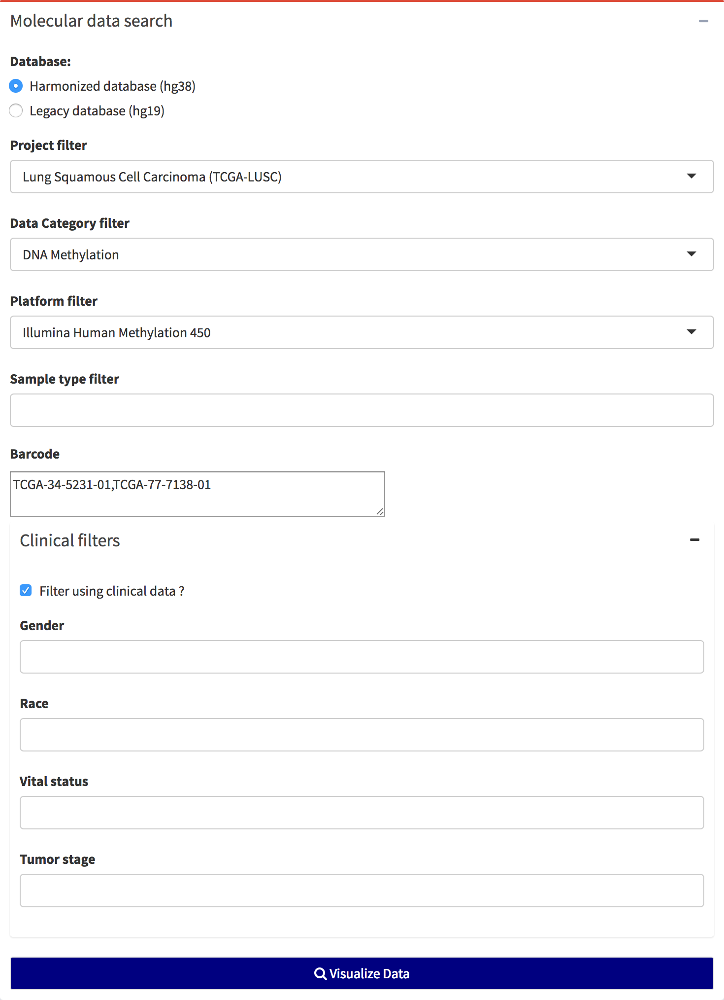
A plot with the summary of the data will be shown.
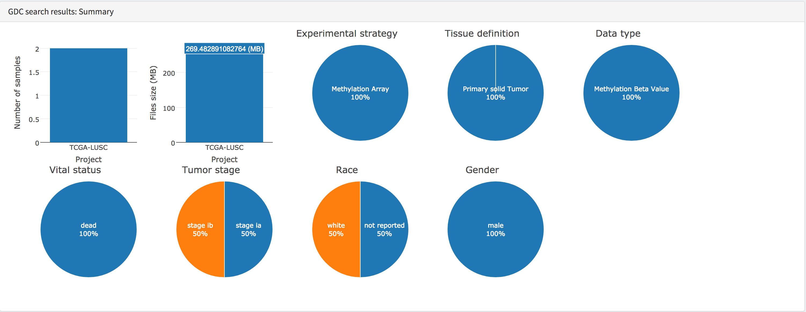

After the query is completed, you will be able to download the data and convert it to
an R object in the `Download & Prepare` section.
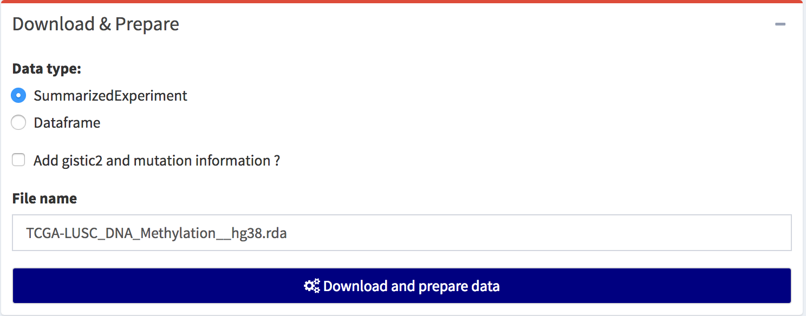

If successful it will give you a message where the data was saved.
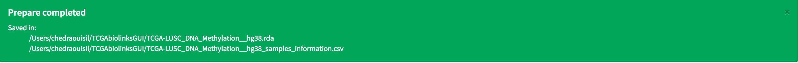

# Session Info

```{r sessioninfo, eval=TRUE}
sessionInfo()
```

# Bibliography
